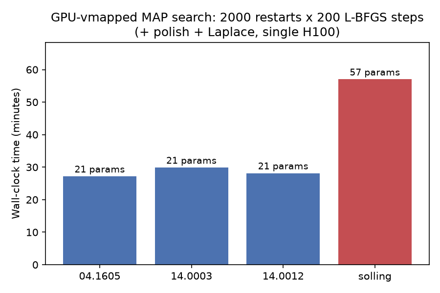
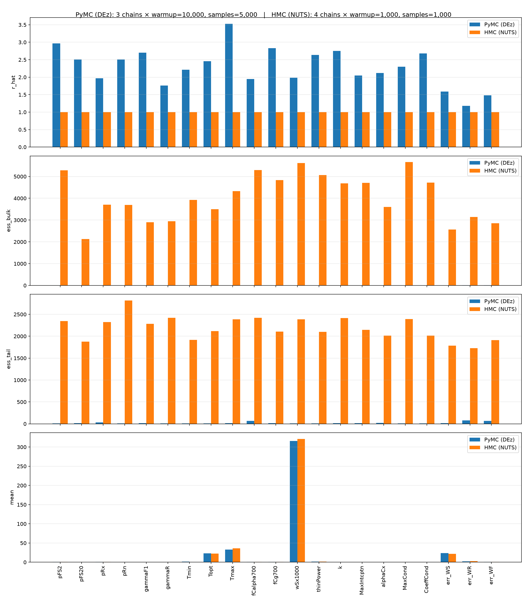
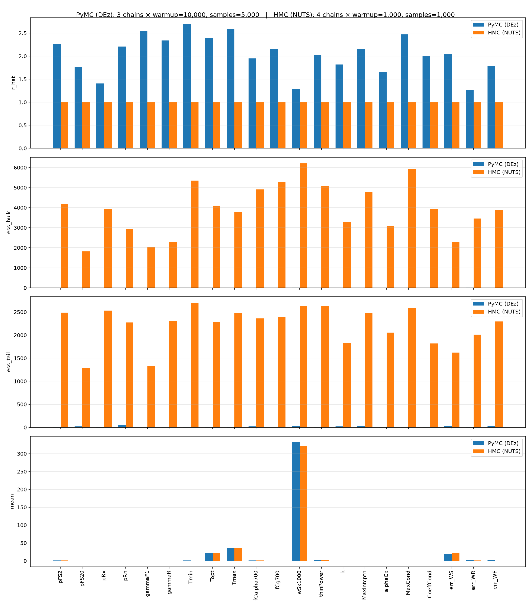
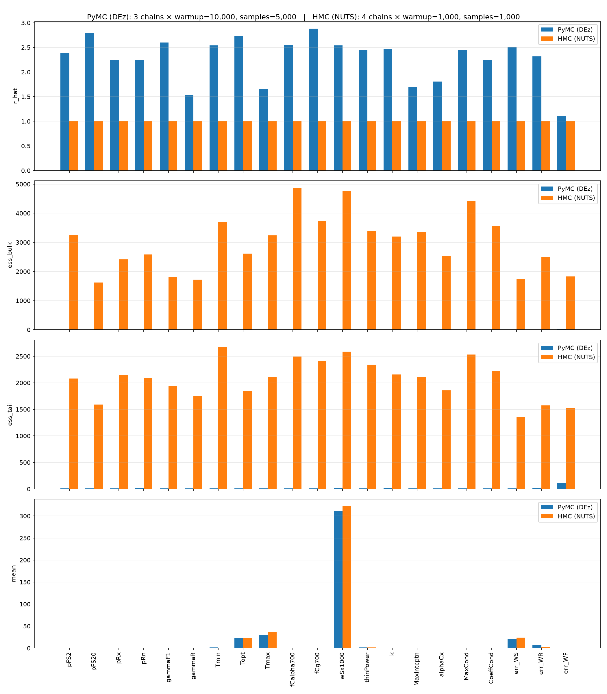
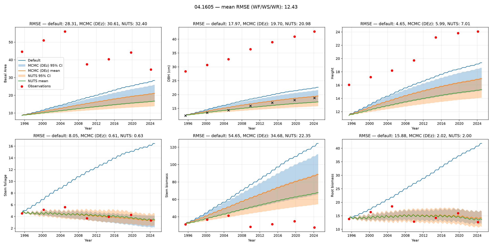
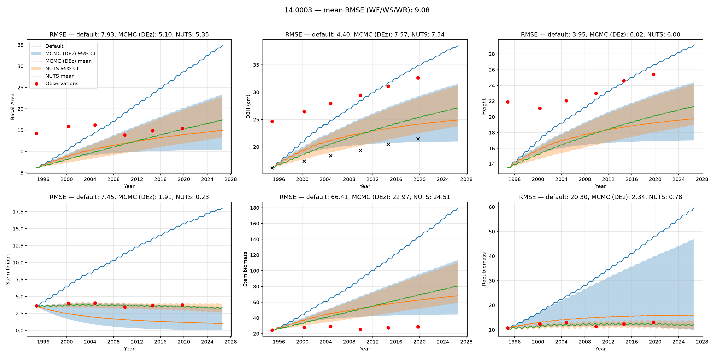
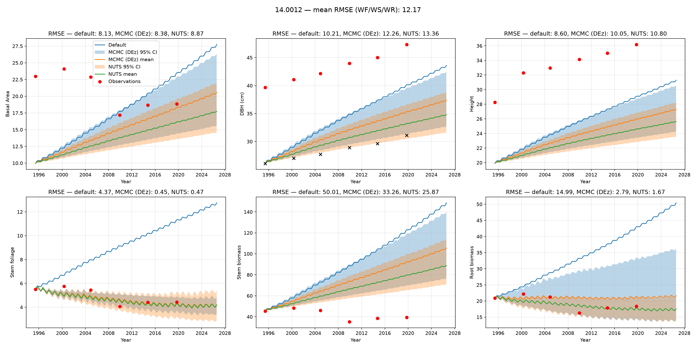
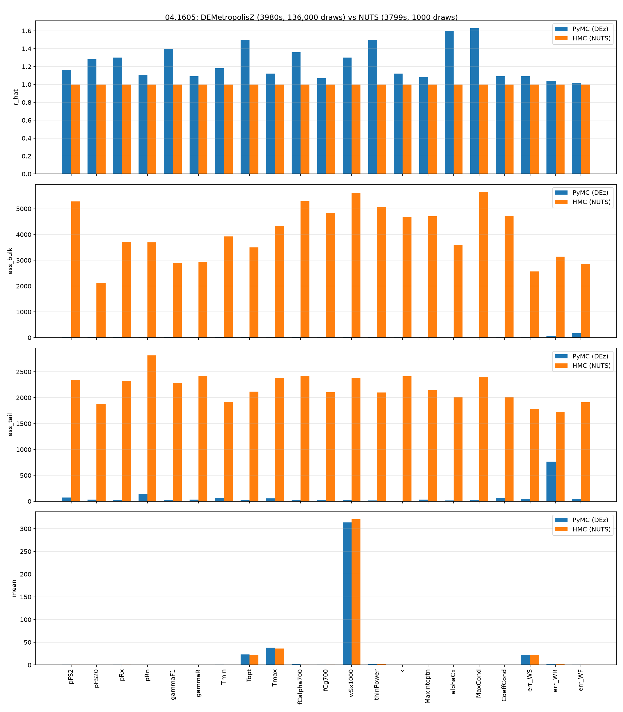
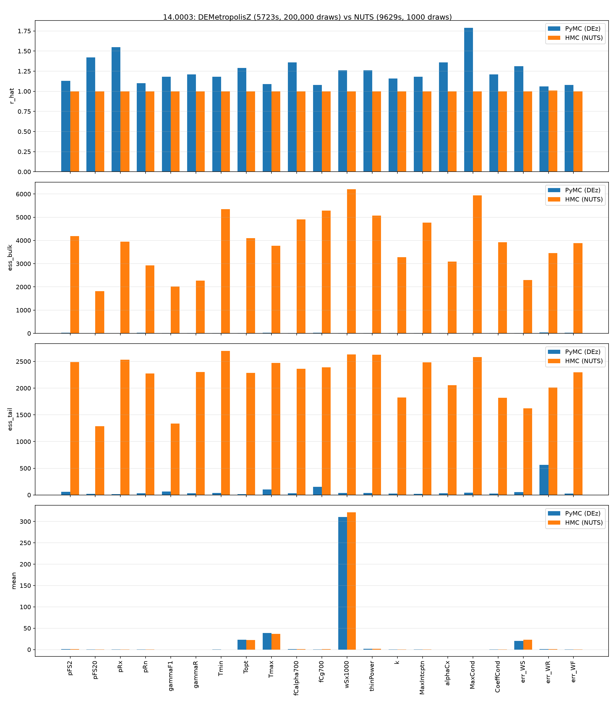
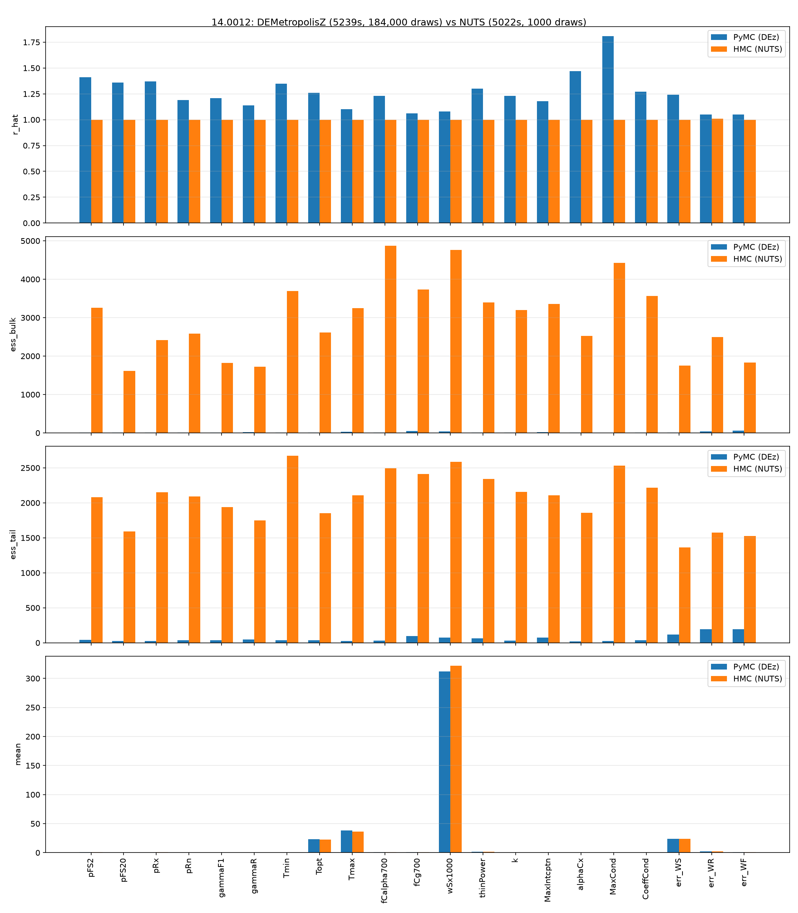

# Differentiable 3PG: calibration efficiency results

Status: complete. All planned runs (MAP search timing, MCMC vs. NUTS at
default and matched wall-clock budgets, and Solling NUTS and
`DEMetropolisZ` at 57 parameters) have finished. See [Open runs](#open-runs).

## Summary

The JAX implementation of 3PG is differentiable, which allows the calibration
log-posterior's gradient to be computed exactly and used by a gradient-based
MCMC sampler (NUTS), as an alternative to the gradient-free `DEMetropolisZ`
sampler that PyMC uses by default. On the three ICP sites tested (21
calibrated parameters each: 18 physiology parameters and 3 observation-noise
sigmas), `DEMetropolisZ` did not converge under any tested draw count: R-hat
ranged from 1.6 to 3.5 and effective sample size remained in the single
digits. Increasing the draw count to 136,000–200,000, at wall-clock budgets
matching or exceeding those used by NUTS, did not substantially change either
diagnostic. NUTS reached R-hat ≈ 1.00 and effective sample sizes in the
thousands using 1,000 post-warmup draws per chain.

The same pattern held at Solling (57 calibrated parameters), a larger site
outside the three used for the main comparison: `DEMetropolisZ` run to its
full 200,000-draw ceiling (40x its default-budget draw count, in well under
its matched wall-clock allowance) still left R-hat at 1.25–3.10 and minimum
ESS at 3, no better than the 21-parameter ICP sites and worse on ESS than
NUTS achieved there in a fraction of the wall-clock time.

These results indicate that, on this posterior, gradient-free MCMC does not
converge at the tested budgets, while gradient-based MCMC converges reliably.
The latter is available only because 3PG is differentiable.

This document also reports wall-clock timing for the GPU-vmapped multi-start
MAP search (2,000 restarts executed in parallel via `jax.vmap`), which
replaced a sequential CPU restart loop in the MAP+Laplace calibration path.

## 1. GPU-vmapped MAP search wall-clock

2,000 restarts, 200 L-BFGS steps each, vmapped and jitted together on a
single H100 (`batched_map_search`, `map_param_est.py`), followed by a
sequential scipy polish from the best point and a 1,000-draw Laplace
approximation. Reported wall-clock covers the full MAP+Laplace phase, which
is dominated by the vmapped search.

| Site | Params | Restarts | Wall-clock |
|---|---|---|---|
| 04.1605 | 21 | 2000 | 27.2 min |
| 14.0003 | 21 | 2000 | 29.9 min |
| 14.0012 | 21 | 2000 | 28.2 min |
| solling | 57 | 2000 | 57.0 min |

## 2. MCMC (DEMetropolisZ) vs NUTS — default budgets

`DEMetropolisZ`: 3 chains, 10,000 warmup draws and 5,000 post-warmup draws
(PyMC/`run_pymc_analysis` defaults). NUTS: 4 chains, 1,000 warmup draws and
1,000 post-warmup draws, `target_accept=0.9`. Both samplers were fit only to
biomass observations (WS/WF/WR); DBH, BA, and Height are simulated but
excluded from the likelihood (see `TODO.md`).

| Site | Method | Wall-clock | min ESS(bulk) | max R-hat |
|---|---|---|---|---|
| 04.1605 | DEMetropolisZ | 20.4 min | 3.0 | 3.53 |
| 04.1605 | NUTS | 63.3 min | 2126 | 1.00 |
| 14.0003 | DEMetropolisZ | 21.5 min | 4.0 | 2.70 |
| 14.0003 | NUTS | 160.5 min | 1813 | 1.01 |
| 14.0012 | DEMetropolisZ | 21.1 min | 3.0 | 2.88 |
| 14.0012 | NUTS | 83.7 min | 1617 | 1.00 |

The three `DEMetropolisZ` chains did not converge to a common posterior mode
at any site (R-hat 2.7–3.5). Minimum ESS of 3–4 indicates that the
worst-mixing parameter carried effectively no usable posterior signal at
these budgets. NUTS met standard convergence criteria (R-hat ≈ 1.00–1.01) at
all three sites.

### Convergence diagnostics per parameter

### Prediction bands

## 3. MCMC vs NUTS — matched wall-clock budget

The comparison in §2 leaves open the possibility that `DEMetropolisZ` would
converge given more draws. To test this, `DEMetropolisZ` was run with a large
draw ceiling and a SLURM walltime cap set to each site's measured NUTS
elapsed time (from `sacct`, plus a buffer); the reported result is whatever
the checkpoint contained at the walltime cutoff, or at the draw ceiling if
that was reached first.

| Site | Method | Wall-clock | Draws | min ESS(bulk) | max R-hat |
|---|---|---|---|---|---|
| 04.1605 | DEMetropolisZ | 66.3 min | 136,000 | 5.0 | 1.63 |
| 04.1605 | NUTS | 63.3 min | 1,000 | 2126 | 1.00 |
| 14.0003 | DEMetropolisZ | 95.4 min* | 200,000 (ceiling) | 4.0 | 1.79 |
| 14.0003 | NUTS | 160.5 min | 1,000 | 1813 | 1.01 |
| 14.0012 | DEMetropolisZ | 87.3 min | 184,000 | 4.0 | 1.81 |
| 14.0012 | NUTS | 83.7 min | 1,000 | 1617 | 1.00 |
| solling (57 params) | DEMetropolisZ | 89.3 min | 200,000 (ceiling) | 3.0 | 3.10 |
| solling (57 params) | NUTS | 1d 14h04m | 4,000 | 25 | 1.11 |

\* At 14.0003, `DEMetropolisZ` reached its 200,000-draw ceiling before
exhausting its allotted wall-clock budget, so it received less wall-clock
time than NUTS at that site. This works against, rather than in favor of,
the comparison's framing. Solling's `DEMetropolisZ` run did the same, in
89.3 minutes against a 38h10m budget.

Across all three ICP sites, increasing `DEMetropolisZ`'s draw count by a
factor of 27–40, at a comparable or greater wall-clock budget, produced small
changes in both diagnostics: minimum ESS moved from 3–4 (at 5,000 draws) to
4–5 (at up to 200,000 draws), and R-hat remained at 1.6–1.8, above the
~1.01 threshold typically used to indicate convergence. The three chains
remained in separate posterior modes; additional draws without gradient
information did not resolve this. Solling shows the same pattern at a larger
scale (57 parameters, 40x its default draw count): R-hat 1.25–3.10 (worst
parameter `fracBB0`), minimum ESS 3 (parameter `Topt`) — no better than the
ICP sites despite the much larger draw ceiling, and worse on both diagnostics
than Solling's own NUTS run (R-hat 1.11, min ESS 25) achieved in a fraction
of the wall-clock time.

## Open runs

All planned runs have completed; none remain open.

- **Solling (57 params) NUTS**: SLURM job 16526 on `disco`, submitted with a
  4-day walltime cap and `--checkpoint-every 100` (see `fix(bayesian): honor
  the passed-in checkpoint_every` — a prior attempt, job 16435, produced no
  checkpoints over a 12-hour run because a pre-existing bug silently ignored
  the requested checkpoint interval). The job completed after 1 day 14h04m
  (4 chains, 1,000 warmup and 1,000 post-warmup draws each). Convergence
  diagnostics: max R-hat 1.11, median R-hat 1.05, min ESS(bulk) 25 (all three
  worst on parameter `k`). This does not meet the ~1.00–1.01 threshold
  reached at the 21-parameter ICP sites, indicating that NUTS at this budget
  did not fully converge at 57 parameters, though it remains substantially
  better than any `DEMetropolisZ` result in this comparison (R-hat 1.6–3.5).
  Per-iteration cost at 57 parameters exceeded what a linear scaling from the
  21-parameter ICP sites would predict, plausibly reflecting the cost of
  NUTS's warmup-phase step-size and mass-matrix adaptation at higher
  dimension.
- **Solling DEMetropolisZ (matched budget)**: SLURM job 16564 on `disco`,
  sized off the NUTS run's elapsed time per the procedure in §3
  (`--time=38:10:00`). Completed in 1h29m20s — reached its 200,000-draw
  ceiling well within budget rather than being cut off by the walltime cap.
  Convergence diagnostics: max R-hat 3.10 (`fracBB0`), median R-hat 2.05, min
  ESS(bulk) 3 (`Topt`). See §3 for the full comparison against Solling's
  NUTS run.

## Methodology notes

- All MCMC/NUTS runs were fit only to WS/WF/WR (`err_DBH`, `err_BA`, and
  `err_Height` are excluded from the likelihood; see
  `bayesian_config.DIAGNOSTIC_ONLY_ERROR_NAMES` and `TODO.md`).
- ICP site NUTS/DEMetropolisZ jobs ran on `chacha` (Dance partition,
  CPU-only; CPU execution was faster than GPU for NUTS on this problem,
  since NUTS parallelizes only across the ~4 chains and does not benefit
  from GPU batch throughput in the way the vmapped MAP search does). The
  Solling run ran on `disco`.
- Convergence diagnostics (`ess_bulk`, `r_hat`) were computed with
  `arviz.summary` and are reported as the worst value (minimum ESS, maximum
  R-hat) across all calibrated parameters for each run.
