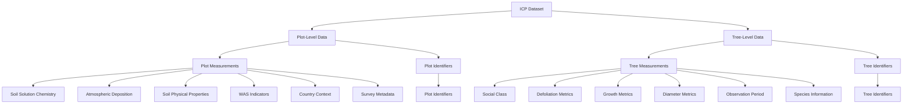

```mermaid
flowchart TD
    A[ICP Dataset]

    %% Level 1: Entity split
    A --> P[Plot-Level Data]
    A --> T[Tree-Level Data]
    
    %% Level 2: Semantic grouping
    P --> PM[Plot Measurements]
    P --> PI[Plot Identifiers]

    T --> TM[Tree Measurements]
    T --> TI[Tree Identifiers]

    %% Plot-level measurements
    PM --> PM1[Soil Solution Chemistry]
    PM --> PM2[Atmospheric Deposition]
    PM --> PM3[Soil Physical Properties]
    PM --> PM4[WAS Indicators]
    PM --> PM5[Country Context]
    PM --> PM6[Survey Metadata]

    %% Plot-level identifiers
    PI --> PI1[Plot Identifiers]

    %% Tree-level measurements
    TM --> TM1[Social Class]
    TM --> TM2[Defoliation Metrics]
    TM --> TM3[Growth Metrics]
    TM --> TM4[Diameter Metrics]
    TM --> TM5[Observation Period]
    TM --> TM6[Species Information]

    %% Tree-level identifiers
    TI --> TI1[Tree Identifiers]

```